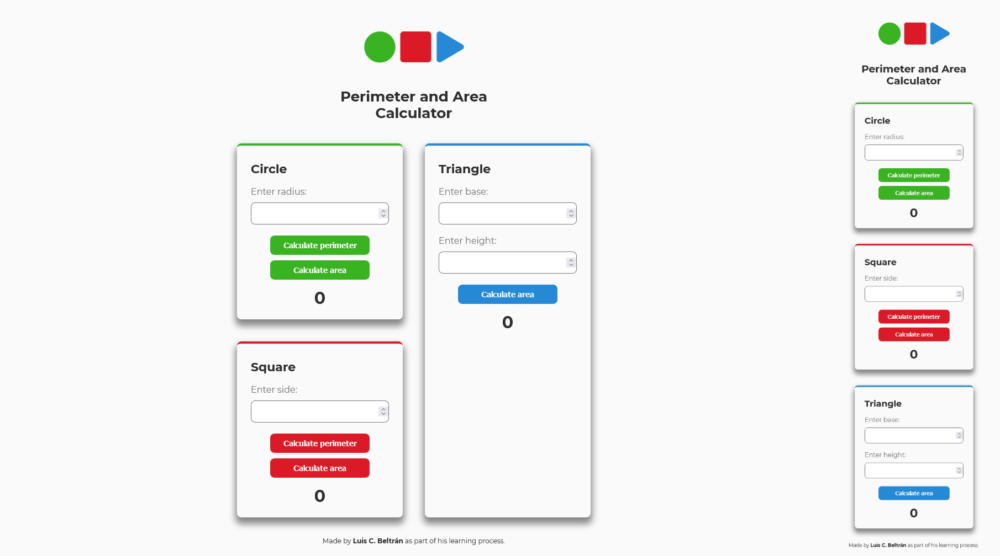

# Perimeter and Area Calculator using JavaScript

This is part of my learning process as a front end developer. I am currently studying at Platzi and Frontend Mentor.

## Table of contents

- [Overview](#overview)
  - [Screenshot](#screenshot)
  - [Links](#links)
- [My process](#my-process)
  - [Built with](#built-with)
  - [What I learned](#what-i-learned)
  - [Continued development](#continued-development)
- [Author](#author)

## Overview

### Screenshot

### Links

- Solution URL: [Github - Perimeter and Area Calculator](https://github.com/LuisCBeltran/PlatziFiguras)
- Live Site URL: [Perimeter and Area Calculator](https://luiscbeltran.github.io/PlatziFiguras/)

## My process

### Built with

- Flexbox
- CSS Grid
- Mobile-first workflow
- Sass
- Pug
- Vanilla JavaScript

### What I learned

- How to use JavaScript to program a basic calculator and to implement it within a web page.
- Consolidation and practice of current CSS/Sass and HTML knowledge. 

### Continued development

This was my first attempt with JavaScript. I think I dit it okey, but I need more practice with the language. More complex projects using JavaScript are imperative. 

## Author

- Website - [Luis C. Beltrán](https://github.com/LuisCBeltran)
- Frontend Mentor - [@LuisCBeltran](https://www.frontendmentor.io/profile/LuisCBeltran)
- Twitter - [@luisc_beltran](https://twitter.com/luisc_beltran)
